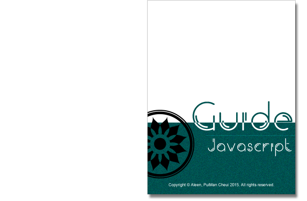

## About

- This is a book which is about the personal guide of JavaScript style, to constraint my coding style. And the guides has combined with [**Airbnb**](https://github.com/airbnb/javascript#types), [**Idiomatic**](https://github.com/rwaldron/idiomatic.js), and so on.
- Continually, I'll write the same other books about **HTML**, **CSS** ,etc.

  

## Start Reading

- Read on [**GitBook**](https://www.gitbook.com/read/book/aleen42/javascript)
- Downloads (eBook has not been not supported yet):
    - ~~**PDF**~~
    - ~~**ePub**~~
    - ~~**mobi**~~

## Categories

- [**Types**](./types/types.md)
- [**References**](./references/references.md)
- [**Objects**](./objects/objects.md)
- [**Arrays**](./arrays/arrays.md)
- [**Destructuring**(解構)](./destructuring/destructuring.md)
- [**String**](./string/string.md)
- [**Functions**](./functions/functions.md)
- [**Arrow Functions**](./arrowFunctions/arrowFunctions.md)
- [**Constructors**](./constructors/constructors.md)
- [**Modules**](./modules/modules.md)
- [**Iterators and Generators**](./iteratorGenerator/iteratorGenerator.md)
- [**Properties**](./properties/properties.md)
- [**Variables**](./variables/variables.md)
- [**Hoisted**(變量聲明提升)](./hoisted/hoisted.md)
- [**Comparison Operators & Equality**](./comparison/comparison.md)
- [**Blocks**](./blocks/blocks.md)
- [**Comments**](./comment/comment.md)
- [**Whitespace**](./whitespace/whitespace.md)
- [**Commas & Semicolons**](./commasSemicolons/commasSemicolons.md)
- [**Type Casting**(類型轉換)** & Coercion**(強制多態)](./typeCastingCoerion/typeCastingCoerion.md)
- [**Naming**](./naming/naming.md)
- [**Accessors**](./accessors/accessors.md)
- [**Events**](./events/events.md)
- [**jQuery**](./jquery/jquery.md)
